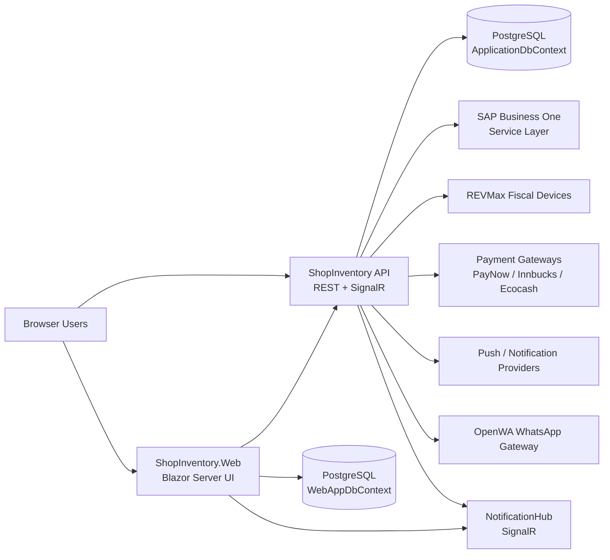
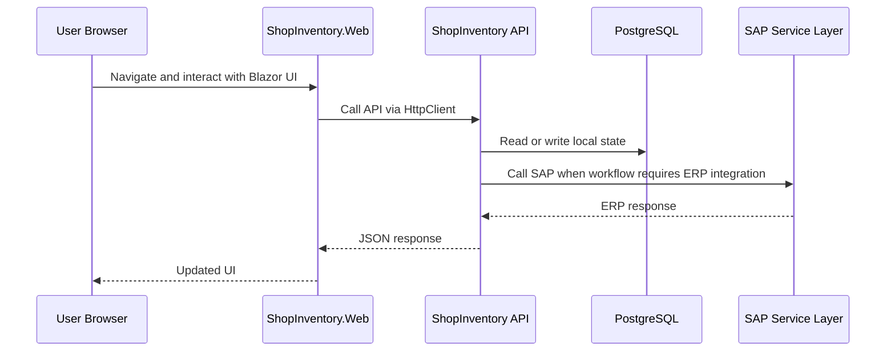

# ShopInventory Architecture

## Purpose

This document provides a practical overview of the ShopInventory solution as it exists in this repository today. It is intended to help developers understand the main runtime components, integration boundaries, architectural patterns, and deployment model before making changes.

## System Overview

ShopInventory is primarily a two-application .NET solution:

- `ShopInventory/` is the ASP.NET Core API and integration backend.
- `ShopInventory.Web/` is the Blazor Server web application used by staff and operators.

The workspace also contains `OpenWA/`, a companion NestJS-based WhatsApp gateway that can be integrated with the API for WhatsApp messaging features.

At runtime, the main system centers on the API. The web app calls the API over HTTP, the API coordinates business workflows, and both applications persist their own data to PostgreSQL.



## Solution Map

### 1. ShopInventory API

The API project is the system of orchestration for business operations. It exposes REST endpoints, hosts the SignalR notification hub, owns the main operational database, and integrates with SAP Business One and other external systems.

Key responsibilities:

- Authentication and authorization for staff, API users, and feature-restricted roles.
- Command and query execution for business workflows.
- SAP posting, validation, synchronization, and document lookup.
- Fiscalization and payment gateway integration.
- Background processing for queued operations.
- Real-time notifications through SignalR.
- Health, readiness, and deployment-safe startup checks.

Primary API building blocks visible in the repository:

- `Controllers/` for HTTP endpoints.
- `Features/` for CQRS vertical slices.
- `Services/` for legacy domain services, infrastructure clients, queues, and background worker support.
- `Data/ApplicationDbContext.cs` for the main EF Core model.
- `Hubs/NotificationHub.cs` for server-push updates.
- `Middleware/` for security and request-processing concerns.

Representative feature areas under `Features/` include invoices, sales orders, purchase orders, stock, payments, reports, route customers, REVMax, customer portal, crates, timesheets, and WhatsApp.

### 2. ShopInventory.Web

The web project is a Blazor Server application that provides the operational UI. It renders server-side interactive pages and communicates with the API using typed `HttpClient` registrations.

Key responsibilities:

- Interactive business UI for invoicing, stock, purchasing, reports, PODs, crates, settings, and administration.
- User authentication state management through a custom Blazor auth provider.
- Local caching and web-specific data such as audit logs and customer portal entities.
- Page-level orchestration, export, printing, and user workflow support.
- Real-time UI notifications and status updates.

Primary web building blocks visible in the repository:

- `Components/Pages/` for page surfaces.
- `Components/Layout/` for shared shell and navigation.
- `Services/` for UI-facing API clients, caches, printing, exports, notifications, and settings.
- `Data/WebAppDbContext.cs` for web-side persistence.
- `wwwroot/app.css` for shared styling and dark theme variables.

### 3. OpenWA

`OpenWA/` is a separate NestJS service packaged in the same workspace. It is not the core of ShopInventory, but it forms part of the broader architecture when WhatsApp features are enabled.

Key responsibilities:

- Manage WhatsApp sessions.
- Receive and dispatch WhatsApp messages.
- Expose a REST API and dashboard for messaging operations.
- Persist OpenWA-specific state using its own Node/NestJS stack.

The .NET API integrates with this service through a typed `OpenWAClient` rather than embedding WhatsApp session management directly into the main application.

## Architectural Style

### Vertical Slice CQRS

The target architectural style for both API and web business logic is vertical slice architecture using CQRS with MediatR.

In practice, this means:

- Reads belong under `Queries/`.
- Writes belong under `Commands/`.
- Optional side effects belong under `Events/`.
- Business logic belongs in handlers rather than controllers.
- Validation is centralized through FluentValidation pipeline behaviors.

Representative feature folders follow this shape:

```text
ShopInventory/Features/{Domain}/
  Commands/{Operation}/
  Queries/{Operation}/
  Events/
```

The repository is currently in a hybrid state:

- Newer and actively migrated functionality lives under `Features/`.
- Older areas still rely on `Services/` for business workflows and infrastructure support.
- Background workers and external system adapters remain service-oriented by design.

### Thin Composition Roots

Both `Program.cs` files are the primary composition roots. They assemble the runtime by registering EF Core, MediatR, validation behaviors, authentication, health checks, HTTP clients, logging, and hosted services.

This keeps infrastructure wiring centralized while allowing feature logic to stay in slice-specific handlers and services.

## Runtime Topology

### API Runtime

The API process hosts:

- REST controllers with API versioning.
- JWT bearer authentication and API key support.
- Serilog logging.
- EF Core with PostgreSQL.
- output caching for selected read-heavy endpoints.
- rate limiting.
- health check endpoints for live, ready, deploy-ready, and dependency probes.
- SignalR notifications at `/hubs/notifications`.
- custom middleware such as mobile version enforcement.

The API also runs multiple hosted background services for asynchronous and long-running work, including:

- reservation cleanup
- cluster state synchronization
- mobile order post-processing
- invoice posting
- invoice fiscalization
- inventory transfer posting
- incoming payment posting
- price catalog synchronization
- failure alerting
- daily stock snapshotting
- end-of-day consolidation

These workers allow the API to separate user-facing request latency from SAP posting, fiscalization, and maintenance operations.

### Web Runtime

The web process hosts:

- Blazor Server interactive components.
- custom authentication state management based on locally stored JWT tokens.
- typed HTTP clients for API access.
- MudBlazor services.
- Blazored LocalStorage.
- Serilog logging.
- EF Core with a separate PostgreSQL context.
- response compression and forwarded-header support.
- health check endpoints.
- hosted services for statement email scheduling and cache preloading.

The web app depends on the API for most operational business data, while keeping a smaller local store for web-specific concerns.

## Data Boundaries

### Main Operational Database

`ShopInventory/Data/ApplicationDbContext.cs` is the API's primary EF Core context. It stores the system's operational records and integration state.

This context backs areas such as:

- identity and authorization-related entities
- queued and tracked business operations
- integration metadata
- audit and operational support entities
- stock, document, and workflow persistence that belongs to the API

### Web Database

`ShopInventory.Web/Data/WebAppDbContext.cs` is a separate EF Core context used by the Blazor application.

This database is used for web-specific concerns such as:

- cached reference data
- audit logs and UI activity support
- customer portal entities
- application settings and role-related web state

The separation keeps the UI application's persistence needs isolated from the API's operational store.

## External Integrations

### SAP Business One

SAP Business One Service Layer is the most important external dependency. The API uses it for core document and master-data workflows, including invoices, stock visibility, purchase operations, and customer data.

Architecturally, SAP sits behind client abstractions and queue-based workflows so the rest of the application does not speak to SAP directly from controllers.

### REVMax

REVMax is used for fiscalization. Invoice and credit-note workflows may continue beyond initial document creation into fiscal processing handled by background services and dedicated feature slices.

### Payment Gateways

The API integrates with PayNow, Innbucks, and Ecocash behind gateway services and feature endpoints.

### Notifications and Push

The solution supports real-time and push-style notifications through:

- SignalR hub updates for connected clients
- notification services in the API and web app
- push registration and delivery flows

### WhatsApp via OpenWA

When enabled, ShopInventory uses OpenWA as an external gateway for WhatsApp messaging and inbox workflows. The .NET API remains the policy and orchestration layer while OpenWA handles WhatsApp session mechanics.

## Key Request and Processing Flows

### Standard Web Flow



### Invoice Critical Path

At a high level, invoice creation follows this pattern:

1. The web or client application submits an invoice command to the API.
2. The API validates the request, permissions, and idempotency.
3. Inventory and batch allocation rules are evaluated.
4. The API acquires inventory or workflow locks where required.
5. The invoice is posted to SAP.
6. Background workers continue downstream processing such as fiscalization, PDF generation, and operator notifications.

This flow is intentionally split between synchronous validation and asynchronous follow-up work to keep request handling bounded while still supporting complex downstream integrations.

## Cross-Cutting Concerns

### Authentication and Authorization

The API supports:

- JWT bearer authentication for application users
- API key authentication for integration access
- role and permission-based authorization

The web app uses a custom authentication state provider that reads token state from local storage and applies Blazor authorization at the UI layer.

### Validation

FluentValidation is wired into MediatR pipeline behaviors so handlers receive validated command and query models.

### Logging

Both .NET applications use Serilog with console and rolling file sinks. Logging is configured centrally in `Program.cs` and tuned to suppress framework noise relative to application events.

### Health and Deployment Safety

Both applications expose multiple health endpoints, including deployment-oriented readiness checks. This supports blue/green style cutover and warm-up validation.

### Time Handling

Timestamps are stored as UTC. CAT conversion is applied only for user-facing output and explicit audit/operator scenarios.

## Deployment Model

The current production deployment model is IIS-first, not container-first.

Operationally important facts:

- Deployments are performed with `./Update-Production.ps1`.
- Production runs on server `10.10.10.9`.
- API and web are deployed as separate IIS applications/app pools.
- Blue/green slot deployment is used to warm the inactive slot before cutover.
- `/health/deploy-ready` is used for warm-up safety checks.
- `/health/ready` and dependency endpoints are used for stricter post-start verification.

The repository also contains Docker assets and a Docker-focused deployment guide, but those should be treated as alternative infrastructure material rather than the primary production path for this environment.

## Directory Guide

Important top-level directories:

- `ShopInventory/` - API application
- `ShopInventory.Web/` - Blazor Server web application
- `OpenWA/` - optional WhatsApp gateway service
- `docs/` - supporting operational documentation
- `scripts/` - environment and supporting automation scripts
- `artifacts/` - validation and build output snapshots

## Design Constraints To Keep In Mind

- Keep business logic out of controllers.
- Prefer new feature work under `Features/` using CQRS and MediatR.
- Treat `Services/` as legacy business workflow surface plus infrastructure support unless a service is clearly integration-focused.
- Keep API reads `AsNoTracking()` and project directly to DTOs in query handlers.
- Use UTC for stored timestamps.
- Preserve dark-mode parity for touched web UI surfaces.
- Use `Update-Production.ps1` for production deployment.

## Related Documents

- `API.md` - endpoint and security surface documentation
- `DEPLOYMENT.md` - environment and deployment reference material
- `SECRETS.md` - runtime configuration and secret management
- `.github/copilot-instructions.md` - canonical project instructions for feature and change work
